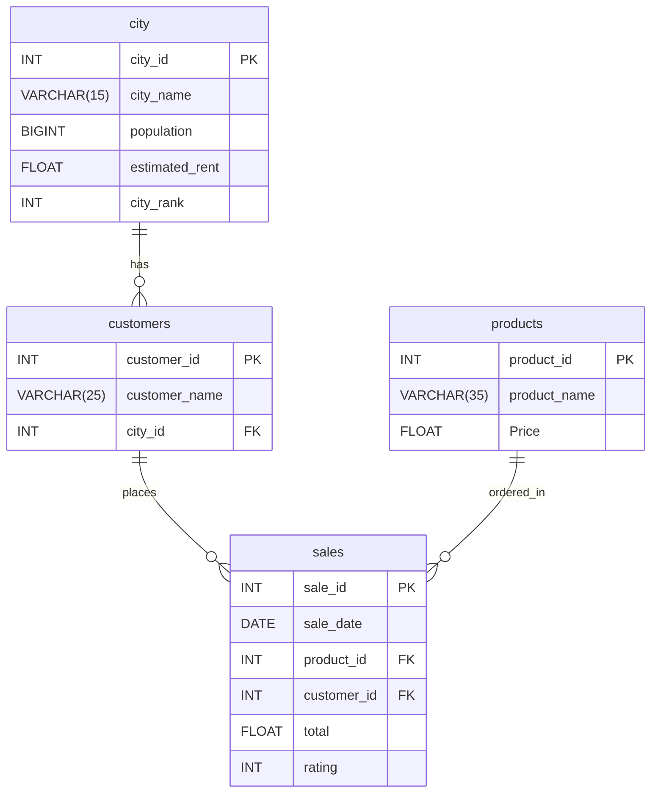

# Urban Brew Haven Expansion Analysis ☕️

## *Crafting Experiences, One Brew at a Time*

## Objective

The goal of this project is to analyze the sales data of Urban Brew Haven, a company that has been selling its products online since January 2023, and to recommend the top three major cities in India for opening new coffee shop locations based on consumer demand, sales performance, and rent efficiency.

## Dataset Files
1. `city.csv` - City demographics and rent data
2. `customers.csv` - Customer information
3. `products.csv` - Coffee product details
4. `sales.csv` - Transaction records

## ER Diagram

