# Urban Brew Haven Expansion Analysis ☕️

## *Crafting Experiences, One Brew at a Time*

## Objective

The goal of this project is to analyze the sales data of Urban Brew Haven, a company that has been selling its products online since January 2023, and to recommend the top three major cities in India for opening new coffee shop locations based on consumer demand, sales performance, and rent efficiency.

## Dataset Files
1. `city.csv` - City demographics and rent data
2. `customers.csv` - Customer information
3. `products.csv` - Coffee product details
4. `sales.csv` - Transaction records

## Entities

```mermaid

erDiagram

city ||--o{ customers : "has"

city {

INT city_id PK

VARCHAR(15) city_name

BIGINT population

FLOAT estimated_rent

INT city_rank

}

customers ||--o{ sales : "places"

customers {

INT customer_id PK

VARCHAR(25) customer_name

INT city_id FK

}

products ||--o{ sales : "ordered_in"

products {

INT product_id PK

VARCHAR(35) product_name

FLOAT Price

}

sales {

INT sale_id PK

DATE sale_date

INT product_id FK

INT customer_id FK

FLOAT total

INT rating

}

```

## Key Questions
1. **Coffee Consumers Count**

How many people in each city are estimated to consume coffee, given that 25% of the population does?

2. **Total Revenue from Coffee Sales**

What is the total revenue generated from coffee sales across all cities in the last quarter of 2023?

3. **Sales Count for Each Product**

How many units of each coffee product have been sold?

4. **Average Sales Amount per City**

What is the average sales amount per customer in each city?

5. **Customer Segmentation by City**

How many unique customers are there in each city who have purchased coffee products?

6. **City Population and Coffee Consumers**

Provide a list of cities along with their populations and estimated coffee consumers.

7. **Top Selling Products by City**

What are the top 3 selling products in each city based on sales volume?

8. **Average Sale vs Rent**

Find each city and their average sale per customer and avg rent per customer.

9. **Monthly Sales Growth**

Sales growth rate: Calculate the percentage growth (or decline) in sales over different time periods (monthly).

10. **Market Potential Analysis**

Identify top 3 city based on highest sales, return city name, total sale, total rent, total customers, estimated coffee consumer.

## Recommendations

After analyzing the data, the recommended top three cities for new store openings are:

**City 1: Pune**

1. Average rent per customer is very low (₹294.23).

2. Highest total revenue (1.26M).

3. Average sales per customer is also highest (₹24197.88).

**City 2: Chennai**

1. Highest estimated coffee consumers at 2.78 million.

2. Average sales per customer is also high (₹22479.05).

3. Average rent per customer is ₹407.14 (still under ₹500).

**City 3: Jaipur**

1. Highest number of customers, which is 69.

2. Average rent per customer is very low at ₹156.52.

3. Average sales per customer is better at ₹11644.2.
